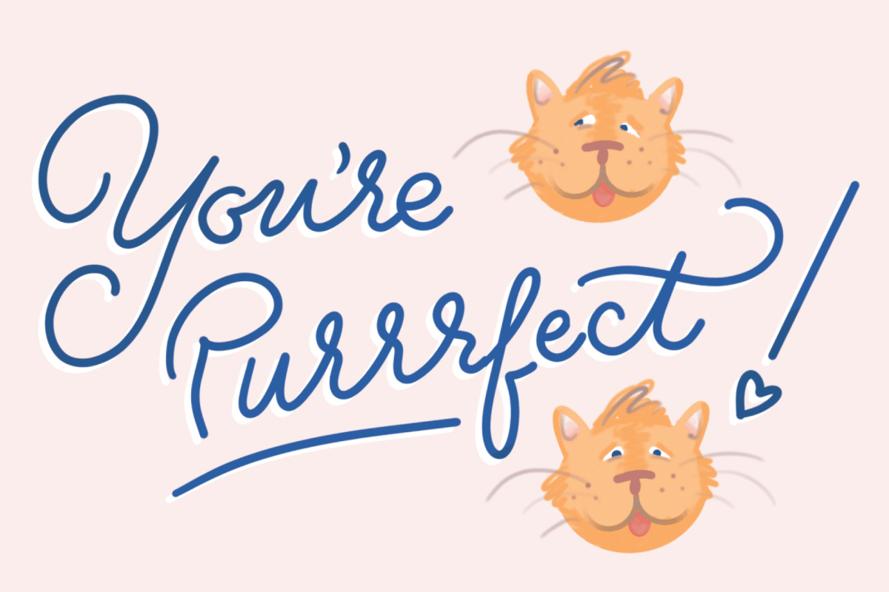
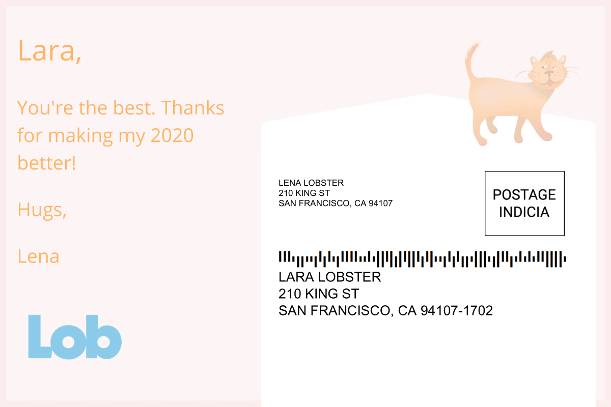
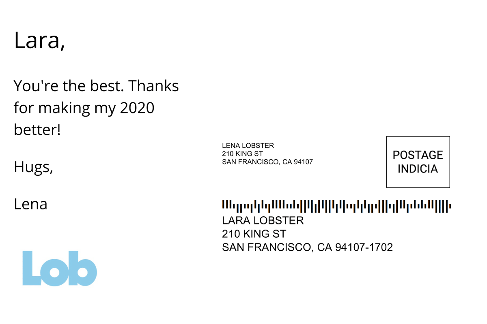
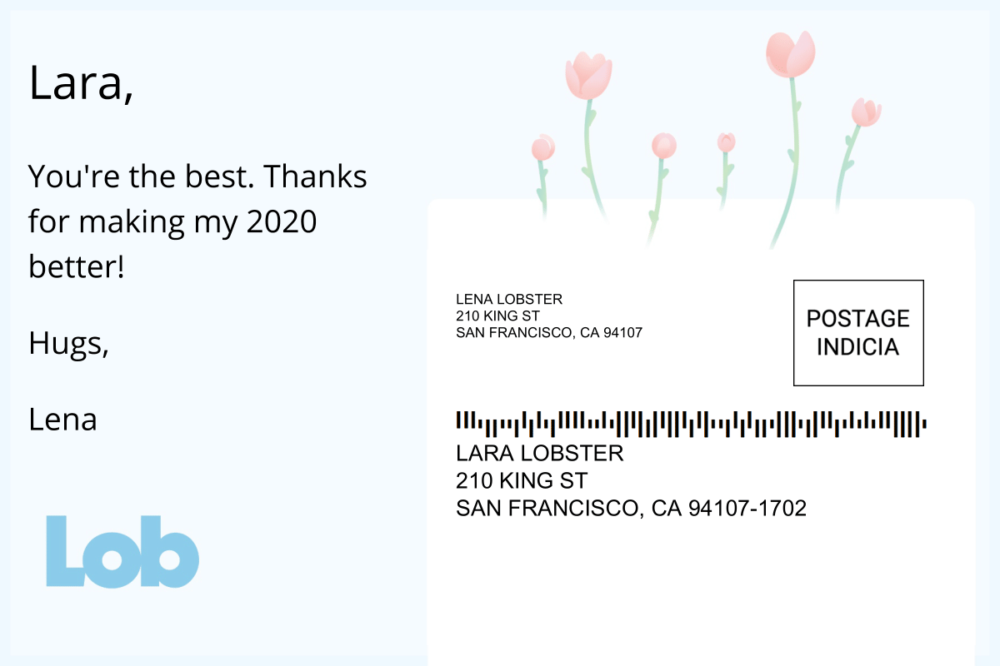

# Lob Love Letters
Hasn't 2020 been quite the year? Have someone (or several) special (people) in your life that made 2020 suck less? Take time this holiday season to send them some love.

## Requirements
- You must have Docker Desktop already downloaded and active. Go [here](https://www.docker.com/products/docker-desktop) to download it if you do not already have it.

## Send A Postcard
1. Make a Lob Account at [Lob.com](https://dashboard.lob.com/#/register)
2. Create a .env file in this repo by typing the following in your terminal: `touch .env`
3. Inside the .env file, create the variable `LOB_API_KEY=`
4. Log into your Lob Account. Once inside, click on your name on the right side. Then click settings. Click on API Keys. Copy your Secret API Key for the Test Environment
5.  Paste your TEST API KEY next to the `=` of the variable `LOB_API_KEY`. Altogether that line should look something like `LOB_API_KEY=test_jkl323hlkjlkjkljklj33`.
6. Chose which postcard to send. Go to the `send_${NAME}_postcard.js` file for that postcard, e.g. `send_cats_postcard.js`.
7. Update the following
    - FRIENDS_ADDRESS 
    - MY_ADDRESS
    - recipient
    - message
    - closing
    - sender
8. When ready, run the following in your terminal to build the Docker image: `npm run build`
9. After the Docker image builds, run the following in your terminal to send the postcard to the TEST environment `npm run send_${NAME}`, e.g. `npm run send_cats`.
10. On the right side of your Lob Dashboard, look for Postcards API. Click on Postcards. This should show you a preview of the postcard you just sent. If you need help finding it, you can look at the description field. It should say something like `Lob Love Letters ${Name} Postcard`, e.g. `Lob Love Letters Cats Postcard`.
11. Click on the row with your postcard. This should open up a page where you can see your postcard better. Check that everything looks correct. If not, change what you need to and repeat steps 7, 9, 10, and 11 until satisfied.
12. Once you are sure that the postcard is how you would like it to be, go back to your Lob dashboard. Click on your name on the right side. Then click settings. Click on API Keys. Copy your Secret API Key for the Live Environment.
13. Replace the value for the variable `LOB_API_KEY`. Altogether that line should now look something like `LOB_API_KEY=live_jkl323hlkjlkjkljklj33`.
14. Run the following in your terminal to send the postcard to the LIVE environment `npm run send_${NAME}`, e.g. `npm run send_cats`. You will be charged the moment this sends. Make sure to not send more postcards than promo credits you've been granted.

## Postcard Options

### Cats Postcard

Send using `npm run send_cats`

### Hey Girl Postcard

Send using `npm run send_hey_girl`

### Thanks Postcard

Send using `npm run send_thanks`

## We're hiring

If you had fun building this, we're hiring! Check out our [careers page](https://www.lob.com/careers#jobs)
